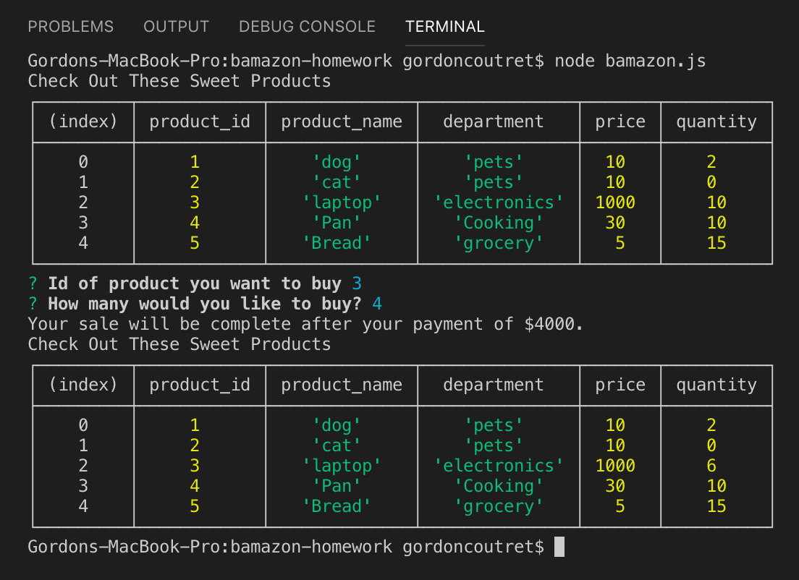

# bamazon-homework
An SQL database for an online market place:
--------------

This console-run app is an exercize in connecting to, and updating an SQL database within a javascript file.
 -------------
 
 Bamazon simply takes a database (Bamazon) from mySQL and displays the items within (stock) as a table.
 
 A prompt will request that you choose an product_id that you would like to purchase and then asks how many you would like to purchase. 
 It then returns the total ammount this transaction would cost and then re-displays the table with the updated stock.
 
 -----------------
 
 
 
 ------------------
 

 

 
